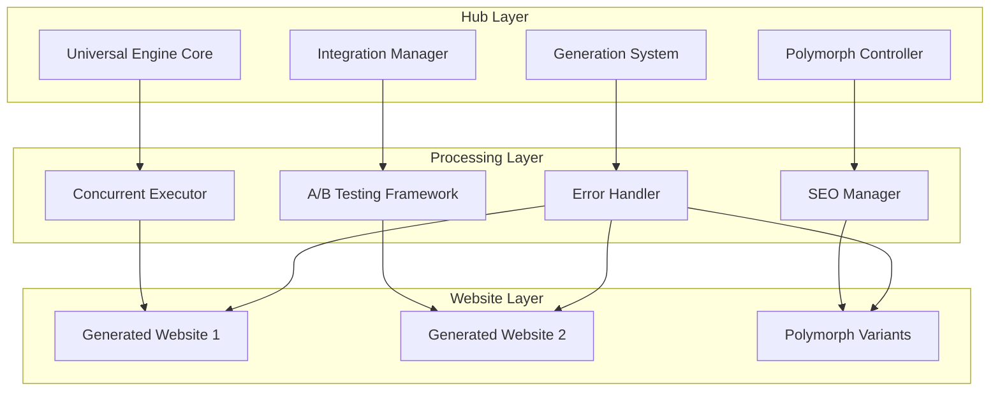

# Design Document

## Overview

The Universal Integration System enhances the Chirag Hub ecosystem by implementing a robust, secure, and efficient framework for managing integrations, polymorphs, and user experience across all generated websites. The system uses a modular architecture with concurrent processing, universal UI injection, and comprehensive error handling to ensure professional-quality websites.

## Architecture

The system follows a **Hub-and-Spoke** architecture with three main layers:



### Core Principles

1. **Security First**: All DOM manipulation uses secure methods to prevent XSS vulnerabilities
2. **Concurrent by Default**: All operations that can run in parallel do run in parallel
3. **Graceful Degradation**: System continues functioning even when components fail
4. **Universal Consistency**: All websites share common UI elements and behavior

## Components and Interfaces

### 1. Universal Engine Core

The central orchestrator that manages all system components and provides the main API.

```javascript
class UniversalEngine {
  constructor(config) {
    this.config = config;
    this.integrationManager = new IntegrationManager(config.integrations);
    this.polymorphController = new PolymorphController(config.polymorphs);
    this.errorHandler = new ErrorHandler(config.errorHandling);
    this.abTesting = new ABTestingFramework(config.abTesting);
  }

  async initialize() {
    // Initialize all components concurrently
    await Promise.all([
      this.integrationManager.initialize(),
      this.polymorphController.initialize(),
      this.injectUniversalUI(),
      this.setupErrorHandling()
    ]);
  }

  async injectUniversalUI() {
    // Secure DOM injection using DocumentFragment
    const fragment = document.createDocumentFragment();

    // Inject header, footer, polymorphs button, and theme system
    await Promise.all([
      this.injectHeader(fragment),
      this.injectFooter(fragment),
      this.injectPolymorphsButton(fragment),
      this.applyThemeSystem()
    ]);

    document.body.appendChild(fragment);
  }
}
```

### 2. Integration Manager

Handles all third-party integrations with automatic validation and graceful degradation.

```javascript
class IntegrationManager {
  constructor(config) {
    this.integrations = new Map();
    this.config = config;
    this.validator = new IntegrationValidator();
  }

  async initialize() {
    const enabledIntegrations = this.filterIntegrationsByWebsiteType();

    // Load integrations concurrently with timeout protection
    const results = await Promise.allSettled(
      enabledIntegrations.map(integration =>
        this.loadIntegrationWithTimeout(integration, 5000)
      )
    );

    this.handleIntegrationResults(results);
  }

  async loadIntegrationWithTimeout(integration, timeout) {
    return Promise.race([
      this.loadIntegration(integration),
      new Promise((_, reject) =>
        setTimeout(() => reject(new Error('Integration timeout')), timeout)
      )
    ]);
  }

  filterIntegrationsByWebsiteType() {
    const websiteType = this.detectWebsiteType();
    return this.config.integrations.filter(integration =>
      integration.applicableTypes.includes(websiteType) &&
      integration.enabled
    );
  }
}
```

### 3. Polymorph Controller

Manages polymorph navigation and generation coordination.

```javascript
class PolymorphController {
  constructor(config) {
    this.config = config;
    this.polymorphs = new Map();
    this.currentWebsite = this.detectCurrentWebsite();
  }

  async injectPolymorphsButton() {
    const polymorphs = await this.getAvailablePolymorphs();

    if (polymorphs.length === 0) {
      return; // Hide button if no polymorphs exist
    }

    const button = this.createPolymorphsButton(polymorphs);
    this.positionButton(button);
    this.attachEventListeners(button, polymorphs);
  }

  createPolymorphsButton(polymorphs) {
    const button = document.createElement('div');
    button.className = 'polymorphs-button';
    button.innerHTML = `
      <button class="polymorphs-toggle">
        <span class="polymorphs-icon">🔄</span>
        <span class="polymorphs-text">Polymorphs (${polymorphs.length})</span>
      </button>
      <div class="polymorphs-menu hidden">
        ${polymorphs.map(p => `
          <a href="${p.url}" class="polymorph-link" data-model="${p.model}">
            ${p.model} Version
          </a>
        `).join('')}
      </div>
    `;
    return button;
  }
}
```

### 4. Concurrent Generation System

Handles parallel generation of projects and polymorphs with proper error handling and progress tracking.

```javascript
class ConcurrentGenerationSystem {
  constructor(config) {
    this.config = config;
    this.rateLimiter = new RateLimiter(config.rateLimit);
    this.progressTracker = new ProgressTracker();
  }

  async generateProject(projectSpec) {
    // Step 1: Generate main version with largest model
    const mainVersion = await this.generateMainVersion(projectSpec);

    // Step 2: Generate polymorphs concurrently
    const polymorphSpecs = this.createPolymorphSpecs(projectSpec);
    const polymorphResults = await this.generatePolymorphsConcurrently(polymorphSpecs);

    // Step 3: Update navigation and sitemaps
    await Promise.all([
      this.updateNavigation(mainVersion, polymorphResults),
      this.updateSitemaps(mainVersion, polymorphResults)
    ]);

    return {
      main: mainVersion,
      polymorphs: polymorphResults
    };
  }

  async generatePolymorphsConcurrently(polymorphSpecs) {
    const concurrencyLimit = this.config.maxConcurrentPolymorphs || 3;
    const batches = this.createBatches(polymorphSpecs, concurrencyLimit);

    const results = [];
    for (const batch of batches) {
      const batchResults = await Promise.allSettled(
        batch.map(spec => this.generatePolymorphWithRetry(spec))
      );

      results.push(...this.processBatchResults(batchResults));

      // Rate limiting between batches
      await this.rateLimiter.wait();
    }

    return results;
  }

  async generatePolymorphWithRetry(spec, maxRetries = 3) {
    for (let attempt = 1; attempt <= maxRetries; attempt++) {
      try {
        return await this.generatePolymorph(spec);
      } catch (error) {
        if (attempt === maxRetries) {
          // Fall back to main version
          return this.createFallbackPolymorph(spec);
        }

        // Exponential backoff
        await this.delay(Math.pow(2, attempt) * 1000);
      }
    }
  }
}
```

### 5. A/B Testing Framework

Client-side A/B testing with session consistency and analytics tracking.

```javascript
class ABTestingFramework {
  constructor(config) {
    this.config = config;
    this.sessionManager = new SessionManager();
    this.analytics = new AnalyticsTracker();
  }

  async initializeTest(testConfig) {
    const userId = this.sessionManager.getUserId();
    const existingVariant = this.sessionManager.getTestVariant(testConfig.id);

    let variant;
    if (existingVariant) {
      // Maintain session consistency
      variant = existingVariant;
    } else {
      // Randomly assign new users
      variant = this.assignVariant(testConfig.variants, userId);
      this.sessionManager.setTestVariant(testConfig.id, variant);
    }

    await this.applyVariant(variant);
    this.trackVariantAssignment(testConfig.id, variant, userId);

    return variant;
  }

  assignVariant(variants, userId) {
    // Use deterministic randomization based on user ID for consistency
    const hash = this.hashUserId(userId);
    const totalWeight = variants.reduce((sum, v) => sum + v.weight, 0);
    const threshold = (hash % 100) / 100 * totalWeight;

    let currentWeight = 0;
    for (const variant of variants) {
      currentWeight += variant.weight;
      if (threshold <= currentWeight) {
        return variant;
      }
    }

    return variants[0]; // Fallback
  }
}
```

## Data Models

### Configuration Schema

```javascript
const UniversalEngineConfig = {
  integrations: {
    analytics: {
      enabled: true,
      providers: ['ga4', 'mixpanel'],
      applicableTypes: ['all']
    },
    monetization: {
      enabled: true,
      providers: ['adsense', 'carbon'],
      applicableTypes: ['utility', 'tool']
    },
    engagement: {
      enabled: true,
      providers: ['feedback', 'social-share'],
      applicableTypes: ['all']
    }
  },

  polymorphs: {
    enabled: true,
    models: ['gpt-4', 'claude-3.5', 'llama-3'],
    maxConcurrent: 3,
    fallbackToMain: true
  },

  abTesting: {
    enabled: true,
    sessionDuration: 86400000, // 24 hours
    trackingEvents: ['click', 'conversion', 'bounce']
  },

  errorHandling: {
    logLevel: 'warn',
    userFriendlyMessages: true,
    fallbackBehavior: 'graceful'
  },

  seo: {
    autoSitemap: true,
    metaTags: true,
    structuredData: true,
    coreWebVitals: true
  }
};
```

### Website Type Detection

```javascript
const WebsiteTypes = {
  UTILITY: 'utility',        // PDF tools, converters
  GAME: 'game',             // Browser games
  CALCULATOR: 'calculator',  // Math tools
  GENERATOR: 'generator',    // Content generators
  VIEWER: 'viewer',         // File viewers
  EDITOR: 'editor'          // Online editors
};

function detectWebsiteType() {
  const indicators = {
    utility: ['convert', 'compress', 'merge', 'split'],
    game: ['game', 'play', 'score', 'level'],
    calculator: ['calculate', 'compute', 'formula'],
    generator: ['generate', 'create', 'make'],
    viewer: ['view', 'preview', 'display'],
    editor: ['edit', 'modify', 'change']
  };

  const title = document.title.toLowerCase();
  const url = window.location.pathname.toLowerCase();
  const content = title + ' ' + url;

  for (const [type, keywords] of Object.entries(indicators)) {
    if (keywords.some(keyword => content.includes(keyword))) {
      return type;
    }
  }

  return 'utility'; // Default fallback
}
```

## Correctness Properties

*A property is a characteristic or behavior that should hold true across all valid executions of a system-essentially, a formal statement about what the system should do. Properties serve as the bridge between human-readable specifications and machine-verifiable correctness guarantees.*

### Property Reflection

After analyzing all acceptance criteria, I identified several areas where properties can be consolidated for better coverage and reduced redundancy:

- **Integration Management**: Properties 1.1-1.5 can be streamlined to focus on core validation, error handling, and configuration
- **UI Injection**: Properties 4.1-4.5 can be combined into comprehensive UI consistency properties
- **Error Handling**: Properties 6.1-6.5 cover similar error handling patterns that can be unified
- **SEO Elements**: Properties 7.1-7.5 can be consolidated into comprehensive SEO compliance properties

### Correctness Properties

**Property 1: Integration Validation and Graceful Degradation**
*For any* Generated_Website with enabled integrations, loading the website should result in all functional integrations being validated and initialized, while failed integrations should be logged and gracefully degraded without breaking core functionality
**Validates: Requirements 1.1, 1.2, 1.3**

**Property 2: Integration Configuration Consistency**
*For any* website type and integration configuration, the Universal_Engine should automatically enable only appropriate integrations for that website type and provide configuration controls that enable/disable integrations without code removal
**Validates: Requirements 1.3, 1.4**

**Property 3: User-Friendly Error Messaging**
*For any* error or unavailable functionality, the Universal_Engine should display user-friendly messages with explanations and alternatives while logging technical details for debugging
**Validates: Requirements 1.5, 6.1, 6.2, 6.5**

**Property 4: Polymorphs Button Injection and Behavior**
*For any* Generated_Website, the Universal_Engine should inject a consistently styled Polymorphs button in the bottom-left corner when polymorphs exist, hide it when none exist, and display correct variants when clicked
**Validates: Requirements 2.1, 2.2, 2.4, 2.5**

**Property 5: Polymorph Navigation Completeness**
*For any* polymorph page, the Universal_Engine should provide navigation links to all other available polymorphs and the main version
**Validates: Requirements 2.3**

**Property 6: Generation Order and Concurrency**
*For any* new project generation, the Generation_System should first create the main version using the largest AI model, then generate all polymorphs concurrently using different models
**Validates: Requirements 3.1, 3.2**

**Property 7: Generation Fallback and Progress Tracking**
*For any* polymorph generation process, failed polymorphs should fall back to the main version, progress should be tracked throughout, and navigation should be updated to include all successful variants
**Validates: Requirements 3.3, 3.4, 3.5**

**Property 8: Universal UI Injection Consistency**
*For any* Generated_Website, the Universal_Engine should inject a consistent header with Hub navigation, footer with Hub links, universal theme system, and Spatial Glass design tokens, ensuring all elements are responsive and accessible
**Validates: Requirements 4.1, 4.2, 4.3, 4.4, 4.5**

**Property 9: Comprehensive Feedback System**
*For any* Generated_Website, the Universal_Engine should provide a feedback widget with multiple channels (text, rating, issue reporting), offer quick feedback options during errors with context, capture technical information on submission, and show confirmation with next steps
**Validates: Requirements 5.1, 5.2, 5.3, 5.4, 5.5**

**Property 10: Graceful Degradation and Fallback Functionality**
*For any* feature failure or third-party service unavailability, the Universal_Engine should implement graceful degradation and provide fallback functionality where possible
**Validates: Requirements 6.3, 6.4**

**Property 11: Comprehensive SEO Implementation**
*For any* Generated_Website, the Universal_Engine should generate accurate sitemaps, inject proper meta tags and SEO elements, implement internal linking to the Hub, and ensure Core Web Vitals and accessibility standards are met
**Validates: Requirements 7.1, 7.2, 7.4, 7.5**

**Property 12: Hub Sitemap Synchronization**
*For any* new website creation, the Generation_System should update the main Hub sitemap to include the new website
**Validates: Requirements 7.3**

**Property 13: A/B Testing Framework Functionality**
*For any* Generated_Website with A/B testing enabled, the Universal_Engine should randomly assign users to variants, maintain session consistency, track interactions for each variant, and provide analytics dashboard for results
**Validates: Requirements 8.1, 8.2, 8.3, 8.4, 8.5**

**Property 14: Concurrent Operations with Rate Limiting**
*For any* generation or API operations, the Generation_System should execute them concurrently where possible, implement proper rate limiting and error handling, retry failed operations with exponential backoff, and provide real-time progress updates
**Validates: Requirements 9.1, 9.2, 9.3, 9.4, 9.5**

**Property 15: Integration Pattern Consistency**
*For any* new integration implementation, the Integration_System should follow the existing integration patterns and properly categorize the integration by functionality
**Validates: Requirements 10.2, 10.3**

**Property 16: Automatic Integration Management**
*For any* website type, the Integration_System should automatically disable integrations not needed for that specific type and maintain up-to-date documentation for all available integrations
**Validates: Requirements 10.4, 10.5**

## Error Handling

The system implements a multi-layered error handling approach:

### 1. Integration Error Handling
- **Timeout Protection**: All integration loads have 5-second timeouts
- **Graceful Degradation**: Failed integrations don't break core functionality
- **Fallback Behavior**: Alternative implementations for critical features
- **User Communication**: Clear, non-technical error messages

### 2. Generation Error Handling
- **Retry Logic**: Exponential backoff for failed operations (1s, 2s, 4s, 8s)
- **Fallback Strategy**: Failed polymorphs fall back to main version
- **Progress Recovery**: System continues with successful operations
- **Resource Cleanup**: Proper cleanup of failed generation attempts

### 3. Runtime Error Handling
- **Global Error Boundary**: Catches and handles unexpected errors
- **Secure Error Logging**: Sanitized error logs without sensitive data
- **User Feedback Integration**: Errors trigger feedback collection opportunities
- **Performance Monitoring**: Track error rates and performance impact

## Testing Strategy

### Unit Testing
The system uses **Jest** for unit testing with the following focus areas:

- **Integration Loading**: Test individual integration initialization and validation
- **DOM Manipulation**: Test secure injection methods and XSS prevention
- **Configuration Management**: Test enable/disable functionality
- **Error Scenarios**: Test specific error conditions and edge cases
- **Utility Functions**: Test helper functions and data transformations

### Property-Based Testing
The system uses **fast-check** for property-based testing with **minimum 100 iterations** per test:

**Property Test Configuration:**
- Each property test references its design document property number
- Tests run with tag format: **Feature: universal-integration-system, Property {number}: {property_text}**
- Generators create realistic test data (website configs, integration specs, user interactions)
- Tests verify universal properties hold across all generated inputs

**Key Property Test Areas:**
- **Integration Validation**: Generate random integration configurations and verify proper handling
- **UI Injection**: Generate different website structures and verify consistent injection
- **Concurrent Operations**: Generate multiple simultaneous operations and verify proper coordination
- **Error Handling**: Generate various error conditions and verify graceful handling
- **A/B Testing**: Generate user sessions and verify consistent variant assignment

### Integration Testing
- **End-to-End Flows**: Test complete user journeys across multiple websites
- **Cross-Browser Testing**: Verify functionality across different browsers
- **Performance Testing**: Measure Core Web Vitals and loading performance
- **Accessibility Testing**: Verify WCAG compliance for all injected elements

### Testing Tools and Libraries
- **Unit Tests**: Jest with jsdom for DOM testing
- **Property Tests**: fast-check for property-based testing
- **Integration Tests**: Playwright for end-to-end testing
- **Performance Tests**: Lighthouse CI for Core Web Vitals
- **Accessibility Tests**: axe-core for accessibility validation

The dual testing approach ensures both specific functionality (unit tests) and universal correctness (property tests) are validated, providing comprehensive coverage for the Universal Integration System.