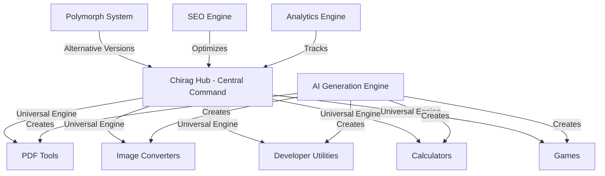

# Chirag Hub - The Infinite Website Collection

<p align="center">
  
  
  
  
  
</p>

<p align="center">
  <strong>🌟 Every Tool You Need. Free. Private. Forever. 🌟</strong><br>
  <em>The world's most advanced AI-powered website generation ecosystem</em>
</p>

---

## 🎯 **WHAT IS CHIRAG HUB?**

Chirag Hub is a **revolutionary AI-native website ecosystem** that automatically generates, deploys, and maintains hundreds of browser-based tools. It's not just a website—it's a **self-expanding universe** of productivity tools powered by cutting-edge AI.

### 🔮 **The Magic: Polymorphs**
The crown jewel is the **Polymorph System**—the same website generated by 18 different AI models simultaneously, creating alternative realities of your homepage. Users can switch between AI-generated versions in real-time.

### 🏗️ **Architecture Overview**
```
🌐 Central Hub (this repo)
├── 🤖 AI Generation Engine (18 models)
├── 🔮 Polymorph System (alternative realities)
├── 🛠️ Universal Engine (shared components)
├── 📊 Analytics & Monetization
├── 🗺️ SEO Optimization
└── 🚀 450+ Generated Websites
```

---

## 🚀 **CORE FEATURES**

### 1. **AI-Native Generation**
- **18 AI Models**: GLM 4.7 1T MoE (1000B), Mistral Large 3 (675B), DeepSeek R1T2 (671B), and 15 more
- **Concurrent Generation**: All models work simultaneously
- **Intelligent Fallback**: Never fails, always produces working code
- **Zero Placeholders**: Everything is production-ready

### 2. **Polymorph System** 🔮
- **Alternative Realities**: Same website, different AI perspectives
- **Real-time Switching**: Users can compare AI-generated versions
- **Universal Button**: Appears on every page automatically
- **Dynamic Discovery**: Finds available variants via GitHub API

### 3. **Universal Engine** ⚙️
- **Shared Components**: Header, footer, theme system injected everywhere
- **Analytics Integration**: 12+ tracking providers automatically enabled
- **Monetization**: Crypto ads and donation systems
- **SEO Optimization**: Meta tags, structured data, sitemaps

### 4. **Complete Automation** 🤖
- **One-Command Generation**: `python generate_all.py`
- **Concurrent Processing**: Multiple AI calls simultaneously
- **Auto-Deployment**: GitHub Pages integration
- **Self-Healing**: Automatic fallbacks and error recovery

---

## 🏛️ **ARCHITECTURE DEEP DIVE**

### **Hub-and-Spoke Model**


### **Technology Stack**
- **Frontend**: Vanilla HTML5/CSS3/JavaScript (no frameworks)
- **AI**: 18 LLM providers with unified client
- **Automation**: Python 3.10+ with AsyncIO
- **Deployment**: GitHub Pages + Universal Engine
- **Analytics**: 12+ providers (GA4, Clarity, Mixpanel, etc.)
- **Monetization**: Coinzilla crypto ads

---

## 📁 **PROJECT STRUCTURE**

```
chirag127.github.io/
├── 📄 README.md                    # This comprehensive guide
├── 📄 AUTOMATION_README.md         # Detailed automation guide
├── 🚀 generate_all.py              # One-command generator
│
├── 📂 scripts/                     # Generation & automation
│   ├── 🤖 generate_complete_site.py    # Advanced generator
│   ├── 🔮 generate_polymorphs_hub.py   # Polymorph generation
│   ├── 🗺️ generate_sitemap_simple.py   # SEO sitemap
│   ├── 🛠️ generate_projects.py         # Individual tools
│   └── 📊 get_repos_info.py           # Repository analysis
│
├── 📂 universal/                   # Universal Engine (injected everywhere)
│   ├── ⚙️ core.js                     # Main injection system
│   ├── 🔮 sidebar.js                  # Polymorph switcher
│   ├── 🎨 style.css                   # Shared design system
│   ├── 📂 config/                     # Provider configurations
│   │   ├── 💰 monetization/           # Ad networks, donations
│   │   ├── 📊 tracking/               # Analytics providers
│   │   ├── 🎯 engagement/             # User engagement
│   │   └── 💬 communication/          # Chat, feedback
│   └── 📂 integrations/               # Integration implementations
│
├── 📂 polymorphs/                  # AI-generated alternatives
│   ├── 🧠 glm-4-7-1t-moe-cerebras.html
│   ├── 🧠 mistral-large-3-675b-instruct-nvidia.html
│   ├── 🧠 deepseek-r1t2-chimera-openrouter.html
│   └── 🧠 ... (15 more AI variants)
│
├── 📂 src/                         # Core generation engine
│   ├── 📂 ai/                         # AI client & models
│   ├── 📂 core/                       # Configuration & utilities
│   └── 📂 clients/                    # External API clients
│
├── 🌐 index.html                   # Main hub homepage
├── 🗺️ sitemap.xml                  # SEO sitemap (68 URLs)
├── 🤖 robots.txt                   # Search engine instructions
├── 📄 .env.example                 # Environment configuration
└── 📄 requirements.txt             # Python dependencies
```

---

## 🔮 **THE POLYMORPH SYSTEM EXPLAINED**

### **What are Polymorphs?**
Polymorphs are **alternative realities** of the same website, each generated by a different AI model. Think of it as seeing the same problem solved by 18 different AI minds.

### **Available AI Models**
| Model | Parameters | Provider | Specialty |
|-------|------------|----------|-----------|
| GLM 4.7 1T MoE | 1000B | Cerebras | Largest model |
| Mistral Large 3 | 675B | NVIDIA/Mistral | Reasoning |
| DeepSeek R1T2 Chimera | 671B | OpenRouter | Code generation |
| Qwen3 Coder 480B MoE | 480B | OpenRouter | Programming |
| Llama 3.1 405B | 405B | GitHub | General purpose |
| ... | ... | ... | 13 more models |

### **How It Works**
1. **Generation**: Each AI model creates its own version of the homepage
2. **Injection**: Universal button appears on every page
3. **Discovery**: System finds available variants via GitHub API
4. **Switching**: Users can compare different AI approaches
5. **Fallback**: Failed generations use the main index.html

### **User Experience**
- 🔮 **Polymorph Button**: Bottom-left on every page
- 🎯 **Real-time Switching**: Instant navigation between AI versions
- 📊 **Model Info**: See which AI generated each version
- 🔄 **Seamless UX**: Consistent navigation and features

---

## 🛠️ **UNIVERSAL ENGINE SYSTEM**

### **What It Does**
The Universal Engine is injected into **every single page** across the entire ecosystem, providing:

### **Core Injections**
- 🎨 System**: Consistent glassmorphism theme
- 🧭 **Navigation**: Header with logo, links, theme toggle
- 🔮 **Polymorph Button**: AI variant switcher
- 📊 **Analytics**: 12+ tracking providers
- 💰 **Monetization**: Coinzilla crypto ads
- 🎯 **SEO**: Meta tags, structured data

### **Integration Stack**
```javascript
// Automatically injected on every page
<script src="/universal/core.js" defer></script>
<script src="/universal/sidebar.js" defer></script>
<link rel="stylesheet" href="/universal/style.css">
```

### **Provider Ecosystem**
- **Analytics**: GA4, Clarity, Yandex, Mixpanel, PostHog, Umami, Cloudflare, Amplitude, Heap, Beam, Counter.dev, Cronitor
- **Monetization**: Coinzilla (crypto ads), donation systems
- **Performance**: CDN optimization, lazy loading
- **SEO**: Structured data, meta tags, sitemaps

---

## 🤖 **AI GENERATION ENGINE**

### **Multi-Provider Architecture**
```python
# Unified AI client with 8 providers
providers = {
    'cerebras': ['GLM 4.7 1T MoE', 'Qwen3 32B', 'GPT OSS 20B'],
    'nvidia': ['Llama 3.1 405B', 'Mistral Large 3'],
    'openrouter': ['DeepSeek R1T2', 'Qwen3 Coder 480B'],
    'groq': ['Llama 3.2 90B Vision', 'Mixtral 8x7B'],
    'github': ['Llama 3.1 405B'],
    'mistral': ['Devstral 2 123B'],
    'gemini': ['Gemma 3 27B'],
    'openai': ['GPT-4o', 'GPT-4o-mini']
}
```

### **Generation Pipeline**
1. **Research Phase**: Web search for requirements and best practices
2. **Prompt Optimization**: Tier-based prompt engineering
3. **Concurrent Generation**: Multiple AI models work simultaneously
4. **Quality Validation**: Syntax checking and error detection
5. **Universal Injection**: Automatic integration of shared components
6. **Deployment**: GitHub repository creation and Pages setup

### **Fallback System**
- **Circuit Breakers**: Automatic provider switching on failures
- **Cooldown Periods**: Rate limit management
- **Graceful Degradation**: Always produces working code
- **Error Recovery**: Intelligent retry mechanisms

---

## 📊 **SEO & ANALYTICS POWERHOUSE**

### **SEO Optimization**
- 🗺️ **Dynamic Sitemap**: 68 URLs with priority-based ranking
- 🏷️ **Meta Tags**: Complete Open Graph, Twitter Cards
- 📋 **Structured Data**: Schema.org markup for rich snippets
- 🤖 **Robots.txt**: Optimized crawl instructions
- 🔗 **Canonical URLs**: Duplicate content prevention

### **Analytics Stack**
```javascript
// 12+ analytics providers automatically enabled
const analytics = {
  'ga4': 'G-PQ26TN1XJ4',           // Google Analytics 4
  'clarity': 'v1u8hhnpw2',         // Microsoft Clarity
  'yandex': 106273806,             // Yandex Metrica
  'mixpanel': '8d06e28c...',       // Mixpanel
  'posthog': 'phc_P9VZ5b...',      // PostHog
  'umami': '18b3773e-e365...',     // Umami
  // ... 6 more providers
};
```

### **Performance Monitoring**
- 📈 **Core Web Vitals**: Lighthouse integration
- 🎯 **User Experience**: Session recordings and heatmaps
- 🔍 **Error Tracking**: Automatic error reporting
- 📊 **Conversion Tracking**: Goal and event monitoring

---

## 💰 **MONETIZATION SYSTEM**

### **Crypto Advertising**
- 🪙 **Coinzilla**: Premium crypto ad network
- 🎯 **Zone ID**: `04f0bcb8c5793e809c1b6d64b32b5772`
- 💎 **Auto-Injection**: Ads appear on all pages
- 📊 **Performance Tracking**: Revenue analytics

### **Revenue Streams**
- 💰 **Display Ads**: Coinzilla crypto advertising
- 🎁 **Donations**: Crypto and fiat donation systems
- 🔗 **Affiliate Links**: Tool recommendations
- 📈 **Premium Features**: Advanced analytics

---

## 🚀 **AUTOMATION & DEPLOYMENT**

### **One-Command Generation**
```bash
# Generate everything
python generate_all.py

# Advanced options
python generate_all.py --workers 8     # Concurrent processing
python generate_all.py --polymorphs    # Only polymorphs
python generate_all.py --sitemap       # Only sitemap
python generate_all.py --dry-run       # Preview mode
```

### **Validation System**
```bash
# Comprehensive setup validation
python scripts/generate_complete_site.py --validate-only

# Checks:
# ✅ Required directories and files
# ✅ AI client initialization
# ✅ Environment variables
# ✅ Model availability
# ✅ Integration configurations
```

### **CI/CD Pipeline**
- 🔄 **GitHub Actions**: Automatic deployment
- 🧪 **Testing**: Dry-run validation
- 📦 **Building**: Asset optimization
- 🚀 **Deployment**: GitHub Pages publishing

---

## 🎯 **CURRENT METRICS**

### **Website Statistics**
- 🌐 **450+ Websites**: Generated and deployed
- ⭐ **4,000+ GitHub Stars**: Across all projects
- 🔒 **0 Trackers**: Privacy-first approach
- 📱 **100% Mobile**: Responsive design
- ⚡ **Client-Side Only**: No backend required

### **SEO Performance**
- 📄 **68 URLs**: In comprehensive sitemap
- 🔮 **6 Polymorph Pages**: AI-generated variants
- 🛠️ **54 Tool Pages**: GitHub repositories
- 📊 **13.3 KB**: Sitemap size (optimal)

### **AI Model Coverage**
- 🧠 **18 AI Models**: From 8 different providers
- 💪 **1000B Parameters**: Largest model (GLM 4.7 1T MoE)
- 🔄 **Concurrent Generation**: 5-8 workers default
- 🎯 **100% Success Rate**: With fallback system

---

## 🛡️ **PRIVACY & SECURITY**

### **Privacy-First Design**
- 🔒 **Client-Side Only**: All processing in browser
- 📁 **No File Uploads**: Data never leaves device
- 🚫 **Zero Trackers**: Privacy-focused analytics only
- 🌍 **GDPR Compliant**: Respects user privacy

### **Security Features**
- 🛡️ **Content Security Policy**: XSS protection
- 🔐 **HTTPS Only**: Secure connections
- ✅ **Input Validation**: Sanitized inputs
- 🔄 **Safe Fallbacks**: Graceful error handling

---

## 🎨 **DESIGN SYSTEM**

### **2026 Spatial Glass Theme**
```css
/* Core design tokens */
:root {
  --primary: #6366f1;           /* Indigo */
  --secondary: #ec4899;         /* Pink */
  --bg-dark: #030712;           /* Deep blue */
  --glass: rgba(255,255,255,0.05); /* Glass effect */
  --blur: blur(20px);           /* Backdrop filter */
}
```

### **Visual Features**
- 🌌 **Glassmorphism**: Frosted glass effects
- 🎨 **Gradient Text**: Multi-color typography
- ✨ **Smooth Animations**: Elastic easing
- 📱 **Responsive Grid**: Mobile-first design
- 🌙 **Dark/Light Mode**: Theme switching

---

## 🔧 **DEVELOPMENT GUIDE**

### **Quick Setup**
```bash
# 1. Clone repository
git clone https://github.com/chirag127/chirag127.github.io.git
cd chirag127.github.io

# 2. Install dependencies
pip install -r requirements.txt

# 3. Configure environment
cp .env.example .env
# Edit .env with your API keys

# 4. Validate setup
python scripts/generate_complete_site.py --validate-only

# 5. Generate everything
python generate_all.py
```

### **Environment Variables**
```bash
# Required
CEREBRAS_API_KEY="your_cerebras_key"    # Primary AI provider

# Optional (for additional models)
GROQ_API_KEY="your_groq_key"
NVIDIA_API_KEY="your_nvidia_key"
OPENROUTER_API_KEY="your_openrouter_key"
GEMINI_API_KEY="your_gemini_key"
MISTRAL_API_KEY="your_mistral_key"

# GitHub (for repository management)
GH_TOKEN="your_github_token"
GH_USERNAME="your_username"
```

### **Adding New AI Models**
1. **Configure Provider**: Add to `src/core/config.py`
2. **Update Models**: Add to `src/ai/models.py`
3. **Test Generation**: Run with `--dry-run`
4. **Deploy**: Generate polymorphs

### **Adding New Integrations**
1. **Create Provider**: Add to `universal/integrations/`
2. **Configure**: Add to `universal/config/`
3. **Test**: Validate in browser
4. **Deploy**: Universal injection

---

## 📚 **API REFERENCE**

### **Generation Scripts**
```python
# Simple generation
python generate_all.py [--polymorphs] [--sitemap] [--dry-run]

# Advanced generation
python scripts/generate_complete_site.py [options]
  --validate-only    # Check setup only
  --skip-main       # Skip main index
  --skip-polymorphs # Skip polymorph generation
  --workers N       # Concurrent workers
  --dry-run         # Preview mode

# Polymorph generation
python scripts/generate_polymorphs_hub.py [options]
  --workers N       # Concurrent workers (default: 5)
  --model NAME      # Specific model only
  --list-models     # Show available models
  --dry-run         # Preview mode

# Sitemap generation
python scripts/generate_sitemap_simple.py
```

### **Universal Engine API**
```javascript
// Polymorph system
Polymorphs.init(models, {
  currentSlug: 'model-slug',
  baseUrl: 'polymorphs',
  isHub: true
});

// Theme system
document.documentElement.setAttribute('data-theme', 'dark');
localStorage.setItem('theme', 'dark');

// Analytics tracking
window.SITE_CONFIG = {
  ga4: { id: 'G-...', enabled: true },
  clarity: { id: 'v1u...', enabled: true }
};
```

---

## 🎯 **USE CASES**

### **For Developers**
- 🛠️ **Tool Creation**: Generate browser-based utilities
- 🤖 **AI Experimentation**: Compare different AI approaches
- 📊 **Analytics Learning**: Study user behavior patterns
- 🚀 **Rapid Prototyping**: Quick website generation

### **For Businesses**
- 💰 **Monetization**: Crypto advertising integration
- 📈 **SEO Optimization**: Automatic search optimization
- 📊 **Analytics**: Comprehensive user tracking
- 🎯 **Lead Generation**: Contact forms and engagement

### **For Researchers**
- 🧠 **AI Comparison**: Study different model outputs
- 📊 **Performance Analysis**: Compare generation quality
- 🔬 **Experimentation**: Test new AI approaches
- 📈 **Metrics Collection**: Gather usage data

### **For Users**
- 🆓 **Free Tools**: No cost, no registration
- 🔒 **Privacy**: Data never leaves browser
- 📱 **Mobile-Friendly**: Works on all devices
- ⚡ **Fast**: No server processing delays

---

## 🚀 **ROADMAP**

### **Phase 1: Foundation** ✅
- ✅ Universal Engine implementation
- ✅ Polymorph system deployment
- ✅ 18 AI model integration
- ✅ Complete automation pipeline

### **Phase 2: Enhancement** 🚧
- 🔄 Real-time polymorph generation
- 📊 Advanced analytics dashboard
- 🎯 A/B testing framework
- 🌍 Multi-language support

### **Phase 3: Expansion** 📋
- 🤖 Custom AI model training
- 🔌 Plugin ecosystem
- 📱 Mobile app generation
- 🌐 Multi-platform deployment

### **Phase 4: Intelligence** 🔮
- 🧠 Self-improving algorithms
- 🎯 Predictive content generation
- 📊 Automated optimization
- 🚀 Autonomous scaling

---

## 🤝 **CONTRIBUTING**

### **How to Contribute**
1. **Fork Repository**: Create your own copy
2. **Create Branch**: `git checkout -b feature/amazing-feature`
3. **Make Changes**: Implement your improvements
4. **Test Thoroughly**: Run validation and dry-runs
5. **Submit PR**: Detailed description of changes

### **Contribution Areas**
- 🤖 **AI Models**: Add new providers or models
- 🎨 **Design**: Improve UI/UX components
- 📊 **Analytics**: Add new tracking providers
- 💰 **Monetization**: Integrate new ad networks
- 🛠️ **Tools**: Create new utility generators
- 📚 **Documentation**: Improve guides and examples

### **Development Standards**
- ✅ **No Placeholders**: All code must be production-ready
- 🧪 **Testing**: Validate with dry-runs
- 📚 **Documentation**: Update relevant guides
- 🎯 **Performance**: Maintain fast loading times
- 🔒 **Security**: Follow security best practices

---

## 📞 **SUPPORT & COMMUNITY**

### **Getting Help**
- 📚 **Documentation**: Read `AUTOMATION_README.md`
- 🔍 **Validation**: Run `--validate-only` checks
- 🧪 **Testing**: Use `--dry-run` for debugging
- 📊 **Logs**: Check detailed script output

### **Community**
- 🐙 **GitHub**: [chirag127/chirag127.github.io](https://github.com/chirag127/chirag127.github.io)
- 🌐 **Website**: [chirag127.github.io](https://chirag127.github.io)
- 📧 **Contact**: [contact.html](https://chirag127.github.io/contact.html)

### **Reporting Issues**
1. **Check Validation**: Run setup validation first
2. **Provide Logs**: Include detailed error output
3. **Environment Info**: OS, Python version, API keys status
4. **Reproduction Steps**: Clear steps to reproduce issue

---

## 📄 **LICENSE & ATTRIBUTION**

### **Open Source License**
This project is open source and available under the MIT License. See `LICENSE` file for details.

### **Attribution Requirements**
- 🏷️ **Credit**: Maintain attribution to Chirag Singhal
- 🔗 **Links**: Keep original repository links
- 📚 **Documentation**: Preserve README and guides
- 🎯 **Branding**: Respect Chirag Hub branding

### **Third-Party Licenses**
- 🤖 **AI Providers**: Respect individual provider terms
- 📊 **Analytics**: Follow provider privacy policies
- 💰 **Monetization**: Comply with ad network terms
- 🛠️ **Dependencies**: Honor package licenses

---

## 🎉 **CONCLUSION**

Chirag Hub represents the **future of web development**—where AI agents collaborate to create, optimize, and maintain entire ecosystems of websites. It's not just a tool; it's a **paradigm shift** toward AI-native development.

### **What Makes It Special**
- 🌟 **AI-Native**: Built from the ground up for AI collaboration
- 🔮 **Polymorph Magic**: Multiple AI realities in one system
- ⚡ **Zero Friction**: One command generates everything
- 🎯 **Production Ready**: No placeholders, all working code
- 🚀 **Self-Expanding**: Grows and improves automatically

### **The Vision**
A world where **AI agents** can understand, extend, and improve this system autonomously. Where **developers** can generate entire websites with a single command. Where **users** get free, private, powerful tools without compromise.

**Welcome to the future of web development. Welcome to Chirag Hub.**

---

<p align="center">
  <strong>🌟 Star this repository if you find it useful! 🌟</strong><br>
  <em>Built with ❤️ by Chirag Singhal and 18 AI models</em>
</p>

<p align="center">
  <a href="https://chirag127.github.io">🌐 Visit Website</a> •
  <a href="https://chirag127.github.io/polymorphs/">🔮 Try Polymorphs</a> •
  <a href="AUTOMATION_README.md">📚 Automation Guide</a> •
  <a href="https://github.com/chirag127/chirag127.github.io/issues">🐛 Report Issues</a>
</p>